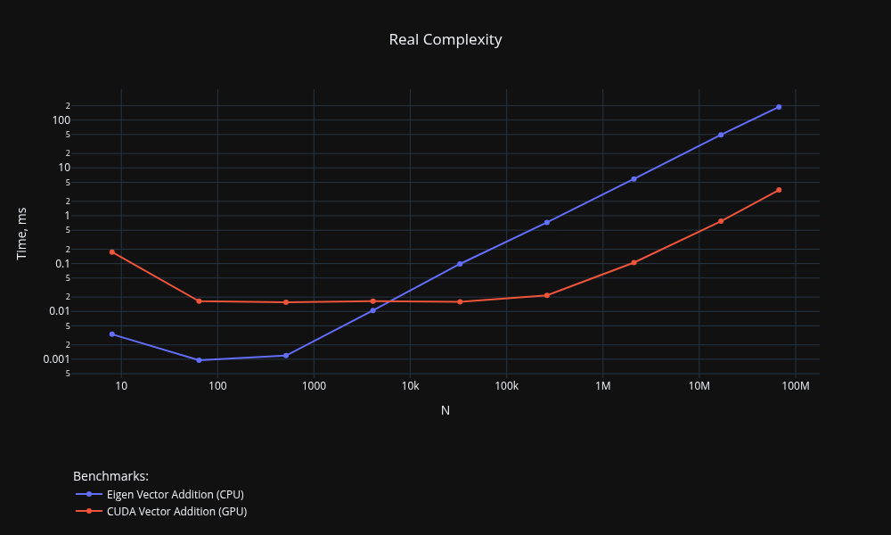
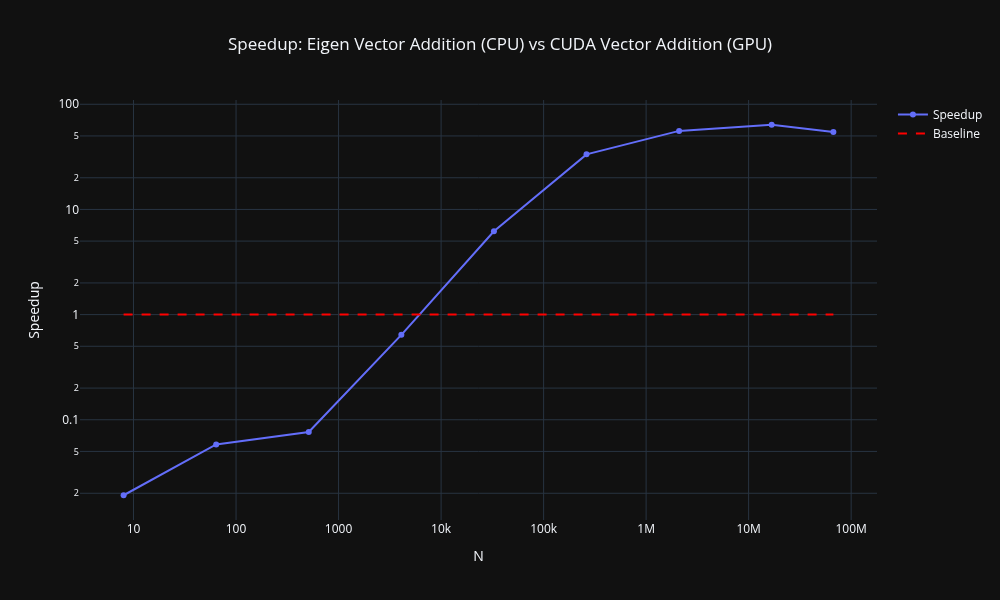

# benchmark-charts

A command-line tool for visualizing [Google Benchmark](https://github.com/google/benchmark) results as interactive HTML charts.

## Features

- **Complexity chart** — plots time complexity curves for benchmarks
- **Speedup chart** — compares two benchmark results and plots the speedup ratio
- Interactive HTML output powered by [Plotly](https://plotly.com/)
- Supports recursive directory scanning for JSON result files
- Dark theme, log scales, and wildcard filtering

## Installation

### From source (recommended for now)

With pip:
```bash
pip install https://github.com/jzcurious/benchmark-charts/archive/refs/tags/v1.0.0.tar.gz
benchmark-charts --help
```

Or with [uv](https://github.com/astral-sh/uv):
```bash
uv add https://github.com/jzcurious/benchmark-charts/archive/refs/tags/v1.0.0.tar.gz
uv run benchmark-charts --help
```

### PyPI *(coming soon)*

> Not yet available. Will be published to PyPI in a future release.

```bash
pip install benchmark-charts
```

Or with [uv](https://github.com/astral-sh/uv):

```bash
uv add benchmark-charts
```

## Usage

```bash
benchmark-charts CHART [options]
```

Available charts: `complexity`, `speedup`.

---

### Complexity Chart

Plots time complexity curves from benchmark results.

```bash
benchmark-charts complexity -i results/ -o complexity.html
```

```
-i, --input      One or more paths to JSON benchmark result files or
                 directories to scan recursively.
--cpu            Plot CPU time instead of real (wall-clock) time.
--xlog           Use a logarithmic scale on the X axis.
--ylog           Use a logarithmic scale on the Y axis.
-wx, --width     Chart width in pixels. Must be between 400 and 1920. Default: 1000.
-hy, --height    Chart height in pixels. Must be between 400 and 1080. Default: 600.
--fullscreen     Stretch the chart to fill the entire browser window.
                 Overrides --width and --height.
--dark           Render the chart using a dark theme.
--show           Open the generated chart in the default browser after rendering.
-f, --filter     Filter benchmarks by name using a wildcard pattern (e.g. 'sort_*').
                 Only matching benchmarks will be included in the chart.
-o, --output     Output path for the generated chart. If the path ends with '/',
                 it is treated as a directory and the filename will be generated
                 automatically. The .html extension will be added if not specified.
                 Default: complexity.html
```

---

### Speedup Chart

Compares two benchmark results and plots the speedup ratio (`target / reference`).

```bash
benchmark-charts speedup -i results/ -r BM_Old -t BM_New
```

Includes all options from the complexity chart, plus:

```
-r, --reference  Name of the benchmark result to use as a reference (denominator).
-t, --target     Name of the benchmark result to compare against the reference (numerator).
--baseline       Add a horizontal baseline at y=1, representing no speedup (equal performance).
```

---

## Examples

Plot complexity from a directory, with dark theme and log scale on both axes:
```bash
benchmark-charts complexity -i results/ --dark --xlog --ylog
```

Plot complexity for specific benchmarks using wildcard filter:
```bash
benchmark-charts complexity -i results/ -f "BM_Sort*"
```

Plot speedup between two benchmarks, save to a directory:
```bash
benchmark-charts speedup -i results/ -r BM_StdSort -t BM_MySort -o charts/
```

Plot speedup with a baseline and open in the browser:
```bash
benchmark-charts speedup -i results/ -r BM_StdSort -t BM_MySort --baseline --show
```

---

## Usage in Google Colab / IPython

Install the package:

```python
!pip install https://github.com/jzcurious/benchmark-charts/archive/refs/tags/v1.0.0.tar.gz
```

Then run any chart command — the result will be rendered inline automatically:

```python
%run -m benchmark_charts complexity -i results/ --dark --xlog --ylog
%run -m benchmark_charts speedup -i results/ -r BM_StdSort -t BM_MySort --baseline
```

## Preview

### Complexity Chart


### Speedup Chart

